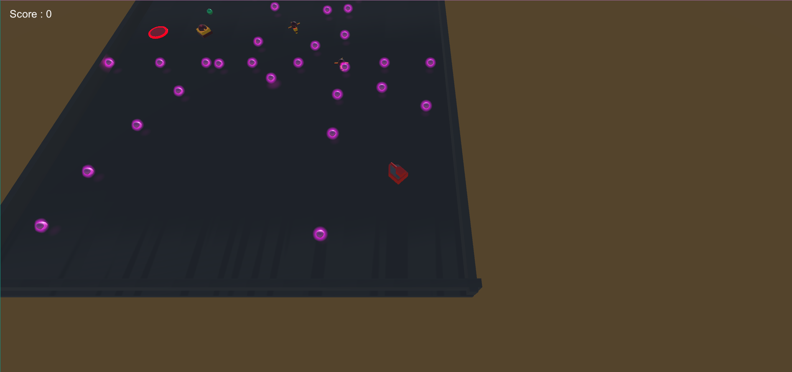
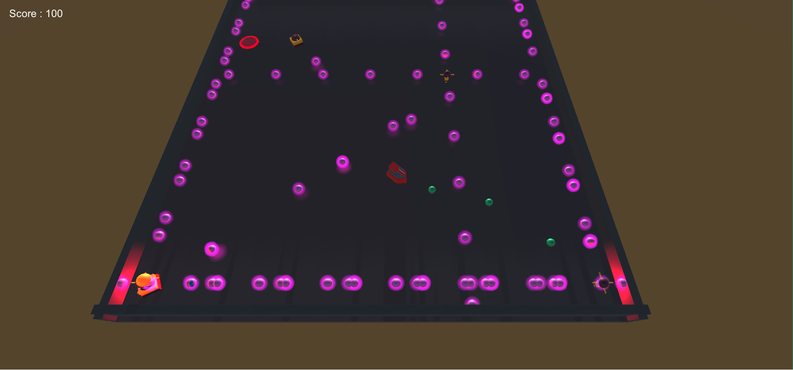

# Shooter

First Unity Project.

The objective was to create a simple game where the player could move around and shoot at targets with bullets.
At first, the controls were using the keyboard but in the end the controls were done using the Xbox360 Controller.

The player is gaining more score points as he defeats the ennemies.

